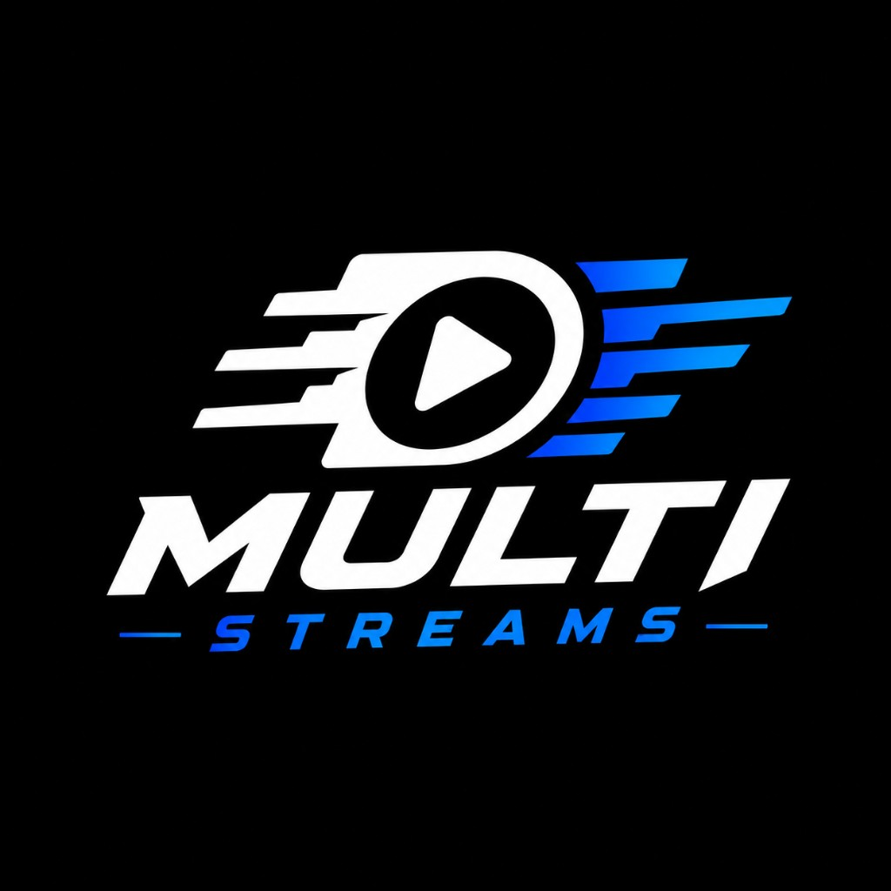
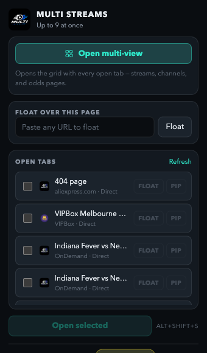
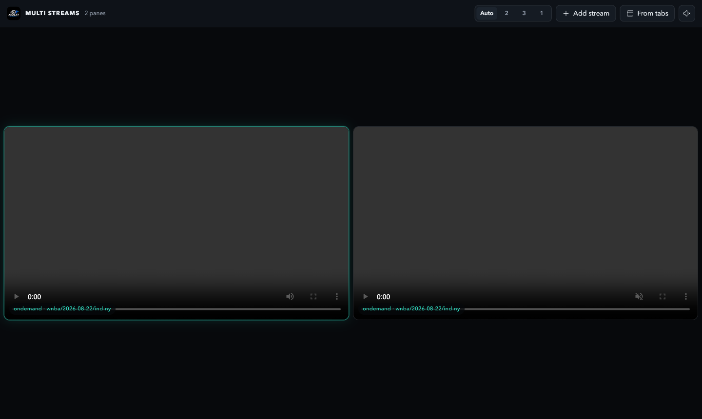
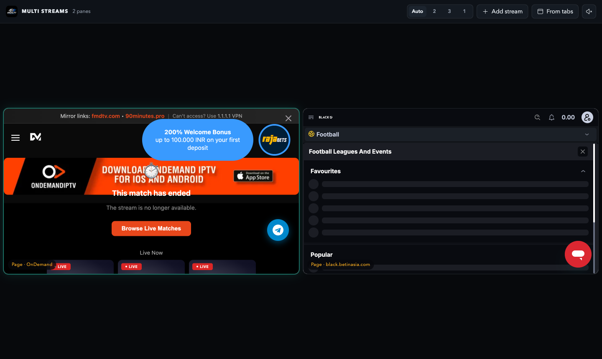
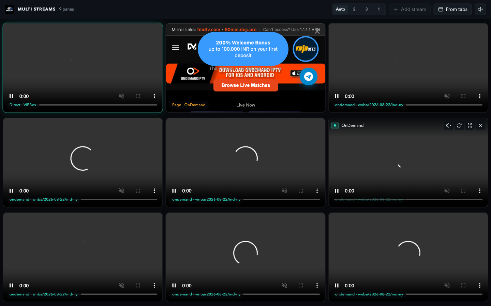

# Multi Streams

Chrome extension — **watch up to 9 videos at once** in one tab (grid, PiP, float overlay).

<p align="center">
  
</p>

[](https://github.com/dheerajgoel17/dual-stream/releases/latest)

**Landing page:** [dheerajgoel17.github.io/dual-stream](https://dheerajgoel17.github.io/dual-stream)

## Screenshots

<p align="center">
  
</p>

<p align="center">
  
</p>

<p align="center">
  
</p>

<p align="center">
  
</p>

## Install from GitHub

1. **[Download latest release](https://github.com/dheerajgoel17/dual-stream/releases/latest)** (or clone this repo)
2. Unzip if needed
3. Open `chrome://extensions`
4. Enable **Developer mode**
5. Click **Load unpacked** → select this folder

Updates: download the [latest release](https://github.com/dheerajgoel17/dual-stream/releases/latest) and click **Reload** on the extension card.

## Features

- **Multi-view** — up to 9 panes, drag to reorder, audio focus (`1`–`9`, `m`)
- **Float** — mini-player over your current tab
- **Picture-in-Picture** — `Alt+Shift+P`
- Embeds: YouTube, Twitch, Kick, Vimeo
- Direct HLS for supported watch URLs (see [docs/USAGE.md](docs/USAGE.md))
- **Odds boards** — load sportsbook pages beside streams

## Shortcuts

| Key | Action |
| --- | --- |
| `Alt+Shift+S` | Open multi-view |
| `Alt+Shift+P` | PiP current tab |

Configure at `chrome://extensions/shortcuts`.

## Development

```bash
npm install
npm test
npm run screenshots   # regenerate marketing PNGs
```

## Support development

Multi Streams is **free and ad-free**. Optional support:

<p align="center">
  <a href="https://buymeacoffee.com/meghnaad">
    
  </a>
</p>

See [docs/SUPPORT.md](docs/SUPPORT.md).

## Docs

- [Usage](docs/USAGE.md)
- [Support / donations](docs/SUPPORT.md)

## License

Use at your own risk. Not affiliated with Google, YouTube, Twitch, or any streaming provider.
